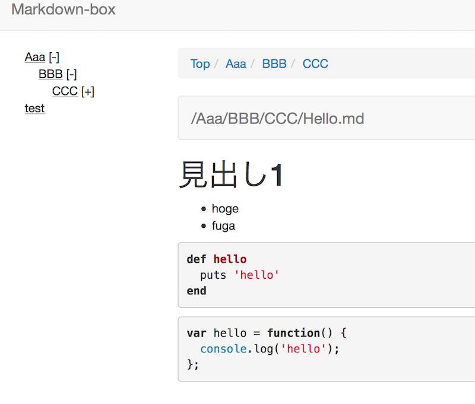

# Markdown-box

Markdown-box will in a little happy to your markdown in Dropbox.

- Support GFM
- Attach images
- Tree view




## Run local server

```
$ cd react-app
$ npm install
$ npm run-script start
```

